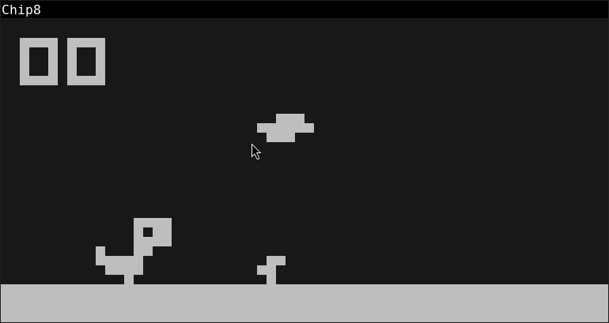

# chip8.h



A lightweight CHIP-8 emulator written in C, implemented as a single-header library with no dependencies — not even libc.

The repository also includes an example emulator built with Raylib, demonstrating how chip8.h can be integrated into a complete application.

## Try it!

Build the Raylib example:

```bash
gcc -o chip8 chip8_raylib.c -lraylib
```

Try one of the games from `roms` folder:

```bash
./chip8 -bg 0x181818FF -fg 0xBEBEBEFF -rs 60 roms/dinorun.ch8
./chip8 roms/br8kout.ch8
```
